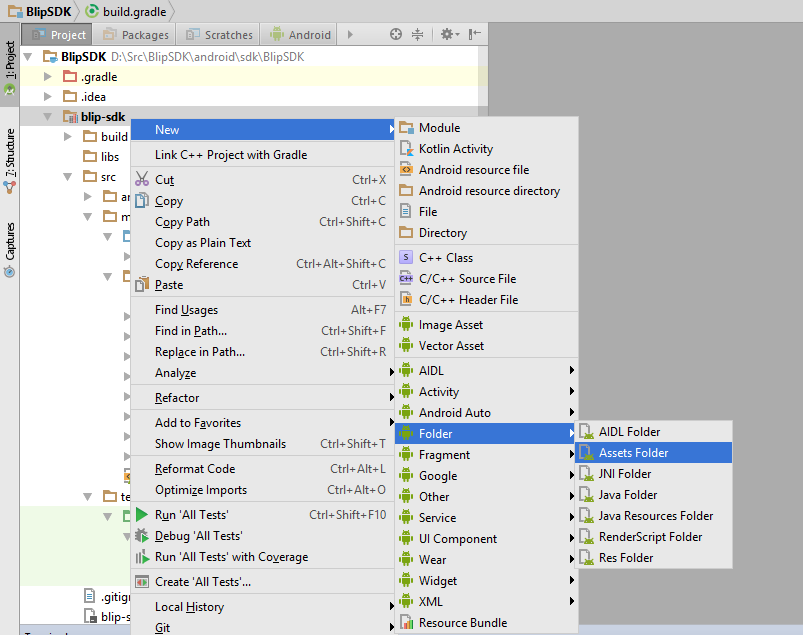

Blip SDK for Android
======

SDK to easily add BLiP conversations in your Android app. For more information see [BLiP portal][1] and [BLiP documentation][2].

Installation
--------

Grab jar via Gradle:
```groovy
compile 'net.take:blip-sdk:0.0.7'
```

or Maven:
```xml
<dependency>
  <groupId>net.take</groupId>
  <artifactId>blip-sdk</artifactId>
  <version>0.0.7</version>
  <type>pom</type>
</dependency>
```

or download [the latest JAR][3] and import in your app.

Snapshots of the development version are available in [Sonatype's `snapshots` repository][snap].

How to use
-------------------------

## Quick start

### Prerequisites

* Add the internet permission on AndroidManifest.xml

```xml
<manifest xlmns:android...>
 ...
 <uses-permission android:name="android.permission.INTERNET" />
 <application ...
</manifest>
```

### Setting your SDK

After include sdk reference on your project you must provide a valid **BLiP owner account**. 
Only with this special account is possible to use this sdk.

__To get an owner account enter in contact with BLiP team__

### After getting your owner account

1. Create a new properties file named **blip.properties** inside the *assets* folder on your project 

*To create a **assets** folder: 'Right click on app module' > 'New' > 'Folder' > Assets Folder*



2. Set your credentials, like bellow, on **blip.properties** file

```groovy
blipsdk.ownerIdentity = your-valid-identity
blipsdk.ownerPassword = your-valid-password
```

### Opening a new BLiP conversation

To open a new thread is very simple. Use **BlipClient** helper class and call *openBlipThread* method

```java
BlipClient.openBlipThread(context, "your-chatbot-identifier");
```

For instance, imagine that you want to establish a new conversation between your customer and your chatbot, when your MainActivity is loaded.

```java
public class MainActivity extends AppCompatActivity {

    @Override
    protected void onCreate(Bundle savedInstanceState) {
        super.onCreate(savedInstanceState);
        setContentView(R.layout.activity_main);

        BlipClient.openBlipThread(this, "testeblipcards");
    }
}
```

*To find your chatbot identifier go to [BLiP Portal](https://portal.blip.ai/#/application), select your chatbot and click 'Settings' on the left bar.

## Advanced features

### Setting information about your client

Sometimes, is very important that your chatbot knows information about your customers, as name or some external identifier for example.
To do this use *setUserAccount* method on **BlipClient** helper class.

```java
Map<String, String> extraInformations = new HashMap<String, String>();
extraInformations.put("some-key", "some-value");

BlipAccount customerAccount = new BlipAccount();
customerAccount.setName("Name");
customerAccount.setPhotoUri("PhotoUri");
customerAccount.setExternalId("ExternalId");
customerAccount.setExtras(extraInformations);

BlipClient.setUserAccount(context, customerAccount);
```

For instance,

```java

public class MainActivity extends AppCompatActivity {

    @Override
    protected void onCreate(Bundle savedInstanceState) {
        super.onCreate(savedInstanceState);
        setContentView(R.layout.activity_main);

        String customerName = "Blip SDK Test User";
        String customerPhotoUri = "http://i.imgur.com/8oL7Ol8.png";
        String customerIdentifier = UUID.randomUUID().toString();
        String someSpecificValue = "<your-specifc-value>";


        Map<String, String> extraInformations = new HashMap<String, String>();
        extraInformations.put("your-specifc-key", someSpecificValue);

        BlipAccount customerAccount = new BlipAccount();
        customerAccount.setName(customerName);
        customerAccount.setPhotoUri(customerPhotoUri);
        customerAccount.setExternalId(customerIdentifier);
        customerAccount.setExtras(extraInformations);

        BlipClient.setUserAccount(this, customerAccount);

        //Now, if you start some thread your chatbot will know some information about your customers
        BlipClient.openBlipThread(this, "chatbotsample");
    }
}
```

License
-------

    Licensed under the Apache License, Version 2.0 (the "License");
    you may not use this file except in compliance with the License.
    You may obtain a copy of the License at

       http://www.apache.org/licenses/LICENSE-2.0

    Unless required by applicable law or agreed to in writing, software
    distributed under the License is distributed on an "AS IS" BASIS,
    WITHOUT WARRANTIES OR CONDITIONS OF ANY KIND, either express or implied.
    See the License for the specific language governing permissions and
    limitations under the License.


 [1]: https://blip.ai
 [2]: https://portal.blip.ai/#/docs/home
 [3]: http://search.maven.org/#search%7Cga%7C1%7Cg%3A%22net.take%22
 [snap]: https://oss.sonatype.org/content/repositories/snapshots/
